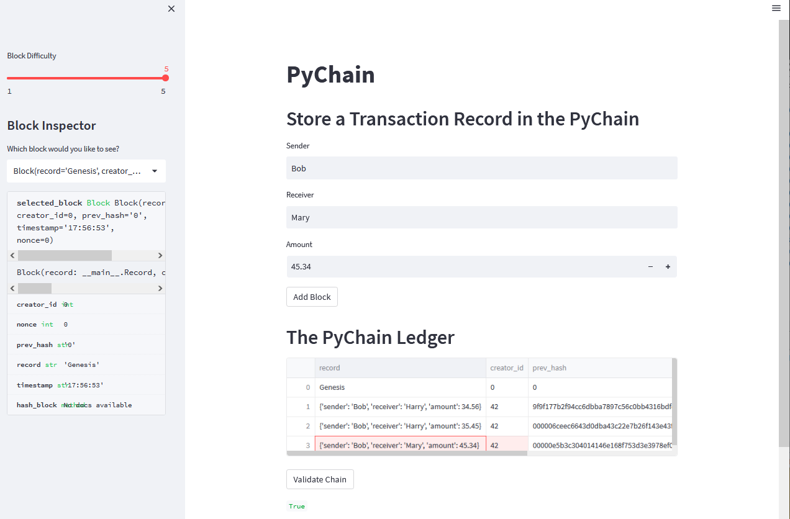

## pychain.py

This streamlit python app is to create a record, block, and chain that demos mined chain ledgers that have transactions we can add.  We can select 1 to 5 "0"s to start the hash.  We are also verifying the chain.

